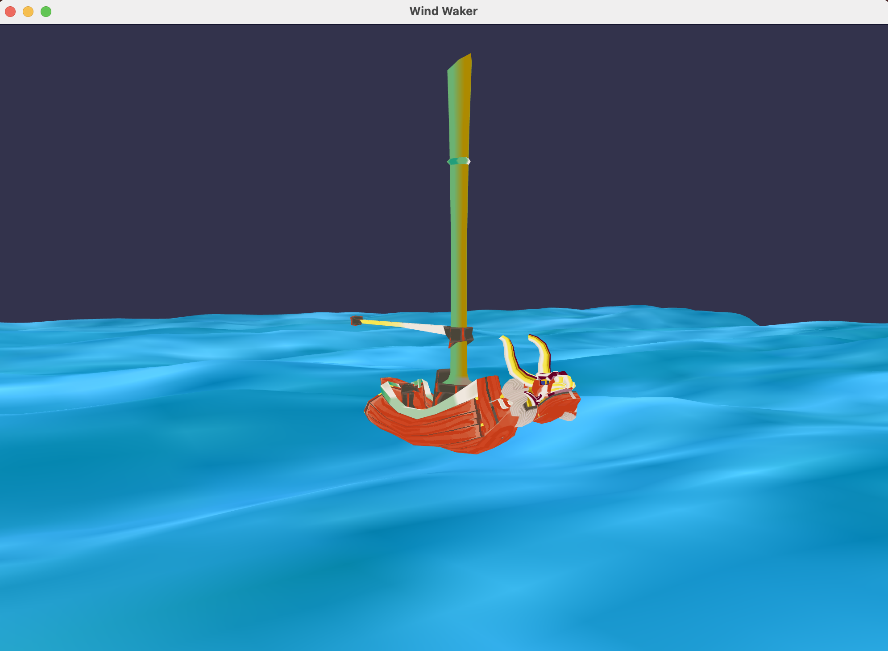
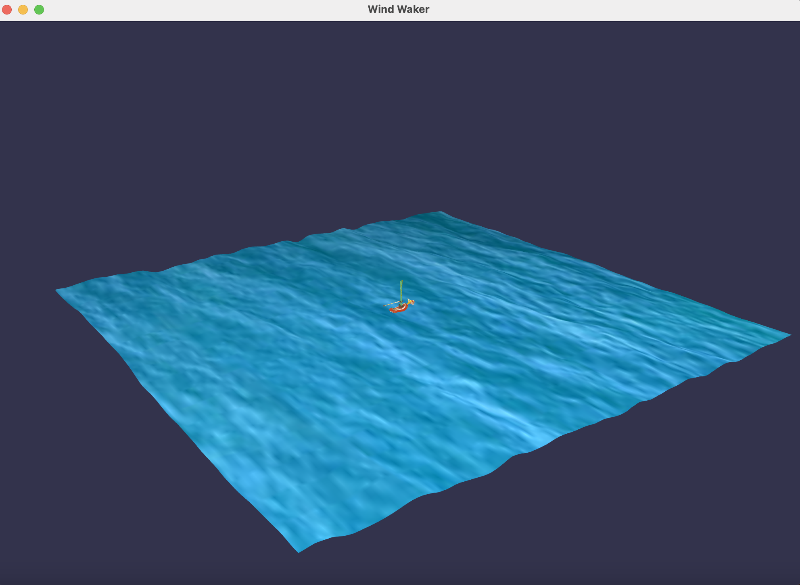

==========
Wind Waker
==========

Python OpenGL program that renders a patch of water and the iconic sailboat from
*The Legend of Zelda: The Wind Waker*. The rendered scene can be explored by
clicking and dragging the mouse and pressing the arrow keys to rotate and zoom.

Preview
-------

*A nice boat ride for Toon Link*.

Requirements
------------

The program requires ``pyopengl``, ``glfw``, ``pyglm``, and ``numpy``. For help
setting up a new Python environment and downloading the packages, check out my
beginner PyOpenGL tutorial, `Hello Triangle<https://github.com/joelenehales/hello-triangle>`_!

Running the Program
-------------------

Download and unzip the project. Once the required packages have been installed
and the correct environment has been activated, the program can be run by
running ``main.py`` from any Python IDE, or from the command line using:

.. code-block:: bash

    python main.py

Once the scene is rendered, the camera can be rotated by clicking and dragging
the mouse, or zoomed in and out by pressing the up and down arrow keys respectively.

Explaination of Source Code
---------------------------

Water Generation
^^^^^^^^^^^^^^^^

The class used to used to generate and render the patch of water can be found in
``water.py``. The patch of water is generated as a simple quad mesh,
which is manipulated using tessellation and geometry shaders to render it as a
patch of water. Vertex data is contained in a vertex array object and restored
to render the mesh. Tessellation uses an outer and inner tessellation level of
16 to interpolate additional vertices. The geometry shader displaces the
interpolated vertex positions by a superpositoin of 4 Gerstner waves at a given
moment in time. The water's color and the displacement map used to manipulate
the mesh are supplied as bitmap images.

Creating the Boat
^^^^^^^^^^^^^^^^^

All classes used to load, store, and render the boat are contained within
``boat.py``. The boat is stored a collection of textured triangle meshes. Vertex
attributes and mesh faces are loaded from a PLY file. The mesh's texture is
loaded from a bitmap image file. This data is contained in a vertex array object
and restored to render the mesh. The shader program includes a geometry shader
which shifts the vertex positions up and down. This creates the effect of the
boat bobbing up and down in the water.

Camera Manipulation
^^^^^^^^^^^^^^^^^^^

The class representing the camera in the scene is defined in ``camera.py``. This
class maintains the camera's attributes, including its position, look direction,
and the direction of up. The camera can be manipulated by clicking and dragging the
mouse to rotate the scene, and pressing the arrow keys to zoom in and out. To
support this type of movement, the camera's position is represented in spherical
coordinates. Class methods are provided to manipulate each coordinate in the
camera's position and handle conversions between Cartesian and spherical
coordinates. Polling for input and adjusting the camera's attributes accordingly
is handled in ``main.py``.
